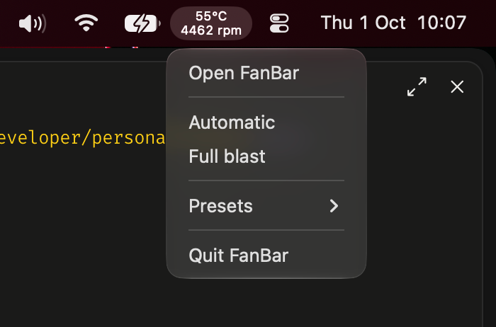
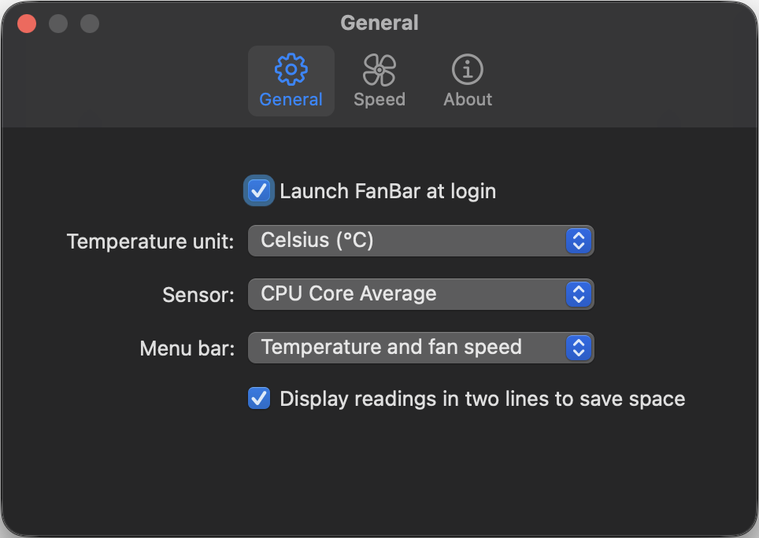
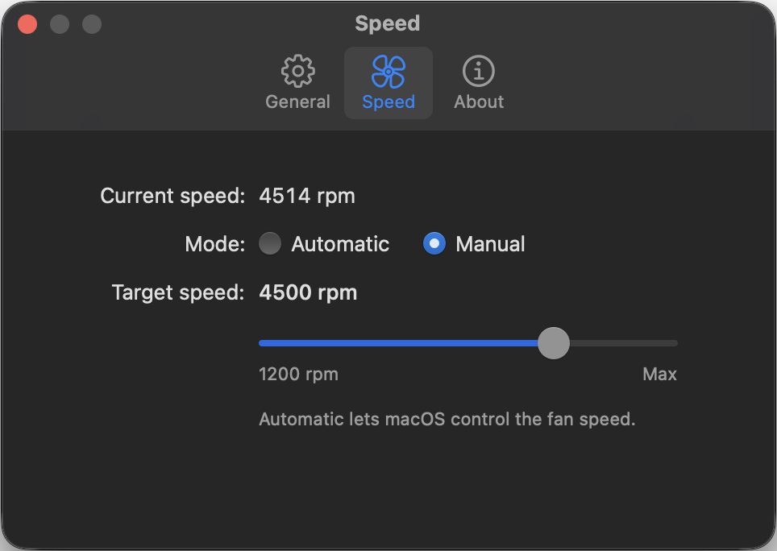

# FanBar

Native macOS menu bar app for monitoring temperature and controlling fan speed.

The menu bar shows the selected sensor's temperature and the fan's measured RPM, read live from the SMC every 2 seconds. Presets only set a target, so if macOS or another app spins the fan up, the readout shows it.

<p>
  
</p>

<p>
  
  
</p>

## Features

- **Menu bar readout**: temperature and fan speed, stacked on two lines or side by side, or either one alone
- **Sensor picker**: CPU core average, individual efficiency/performance cores, GPU clusters, battery, SSD, and more (only sensors your Mac reports are listed)
- **Fan control**: Automatic, Full blast, fixed presets (1000–6000 rpm), or a custom target from the slider, which spans your fan's hardware range and ends at Max
- **Settings**: launch at login, °C / °F, menu bar layout
- **Automatic updates**: checks GitHub releases every 12 hours and installs signed, notarized updates
- **Safe defaults**: restores Automatic mode on quit

## Install

Download the latest `FanBar-<version>.dmg` from [Releases](https://github.com/vipinsight/fanbar/releases/latest), open it, and drag FanBar to Applications. It updates itself after that.

## Requirements

- macOS 13 or later, Apple silicon or Intel
- Per-core sensors are mapped for M1-family chips; other Macs get the general sensors (battery, SSD, CPU proximity on Intel)
- Only the first fan is read and controlled

## Build

```sh
cd fanbar
./build-app.sh
open FanBar.app
```

Local builds are ad-hoc signed and do not update themselves. See [docs/development.md](docs/development.md) for things to know while working on FanBar, and [docs/release.md](docs/release.md) for releasing.

## How fan control works

FanBar reads and writes Apple SMC keys through IOKit. Reading needs no privileges. Changing fan speed installs a small root launch helper on first use; macOS asks for administrator approval once, and later changes go over a local Unix socket without prompting. The helper accepts only `auto` and RPM targets between 1000 and 8000.

Hardware support varies by Mac model and macOS version. Failed SMC reads show `--`.

## License

MIT. See [LICENSE](LICENSE).
